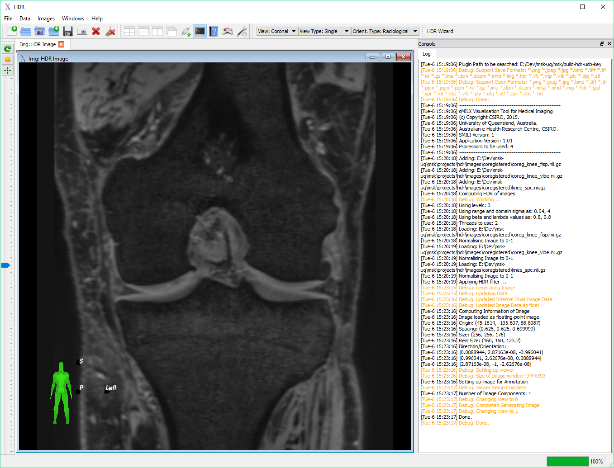

# HDR-MRI

This library contains source code and scripts for the HDR-MRI project published in MRM. 


Please cite this work as:

```
Local Contrast Enhanced MR Images via High Dynamic Range Processing
Chandra SS, Engstrom C, Fripp J, Walker D, Rose S, Ho C, Crozier S. Magnetic Resonance in Medicine. 2018.
```

## ITK Only Build Available
Commandline applications can be built on the topic-itk-only branch and a build of ITK 4.

## Prerequisites 
Commandline applications can be built on the topic-itk-only branch and a build of ITK 4.

For the GUI application and main branch, you will require builds of VTK, ITK 4, Qt 4 and [SMILI](https://smili-project.sourceforge.io/).

I have tested this software on VTK 6.3.0, ITK 4.10, Qt 4.8.7 and SMILI v1.02 on Windows.

On Ubuntu linux systems (12.04+), simply install the repository version of Qt 4, VTK (the version with Qt 4 and VTK-Qt) and ITK. 
We reccomend ITK 4.6.1+ and VTK 5.8+.  Note that VTK 5.10.1 has a few visualisation bugs, so it is not optimal. But in Ubuntu 16.04, VTK 5.10.1 is available in the repository and is built with Qt 4, while VTK 6 is built with Qt 5. Currently SMILI does not support Qt 5, but that will be supported in the future.
For ITK 3 builds, I suggest a local build of ITK 3 with review enabled to get all the features currently available.

## Build Steps

### ITK Only Build
Commandline applications can be built on the topic-itk-only branch and a build of ITK 4.

### GUI Build
Once all of the above dependencies are built or installed, see SMILI YouTube channel for help (https://www.youtube.com/channel/UCD-hU6IF2qGlz7roexAUj1Q)
Then you can build this package.

Ensure to set the 
```
MILXQT_INCLUDE_DIRS
MILXQT_LIBRARY
VTK_EXT_LIBRARY
SMILI_LIBRARY
SMILI_INCLUDE_DIR
```

The VTK, ITK and Qt must match that of the SMILI build. On my system these values were:
```
D:/Dev/smili-release/include/Qt
D:/Dev/smili-release/build-vs2013/lib/Release/milx-Qt.lib
D:/Dev/smili-release/build-vs2013/lib/Release/vtk-ext.lib
D:/Dev/smili-release/build-vs2013/lib/Release/milx-SMILI.lib
D:/Dev/smili-release/include
```

Once set then follow usual CMake build instructions:
```
mkdir build
cd build
ccmake ..
make
```

Use the BUILD_PROJECTS to build the individual sub-projects within the project.

## Troubleshooting
If you get link errors about QMetaStatic and milxQtImage.obj etc., then MILXQT_INCLUDE_DIRS is probably not set correctly.
If you get cant find milxQtImage.h, then SMILI_INCLUDE_DIR is not set correctly.
